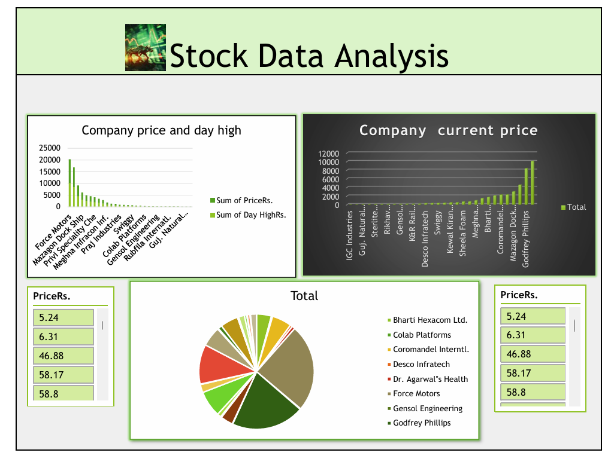

# Stock data analysis:
This Stock Analysis Project is a comprehensive initiative focused on leveraging data analytics to evaluate stock market trends through web scraping and visualization. This project utilizes Python to scrape real-time financial data from publicly available sources, enabling the collection of stock prices, company metrics, and market indicators. The scraped data is then processed and analyzed to uncover insights, which are presented in an interactive dashboard created using Microsoft Excel. This dashboard features dynamic charts, tables, and key performance indicators, providing an intuitive interface for investors and analysts to monitor stock performance and make informed decisions. Ideal for those interested in financial analytics, this repository demonstrates the power of combining Python’s web scraping capabilities with Excel’s robust visualization tools to deliver actionable stock market insights.

## 🌐 Socials:
  

# 💻 Tech Stack:
 
# 📊 GitHub Stats:
 
 

## 🏆 GitHub Trophies

### ✍️ Random Dev Quote

### 🔝 Top Contributed Repo

---

<!-- Proudly created with GPRM ( https://gprm.itsvg.in ) -->
